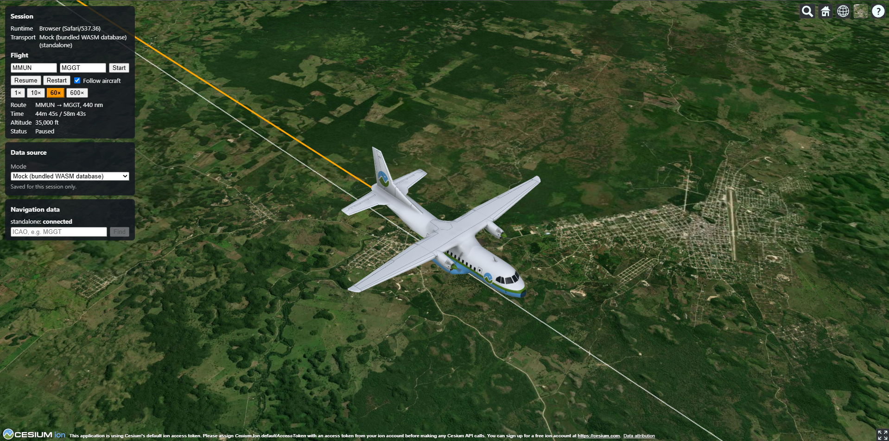

# Cesium3D GeoVis

Geospatial visualization app built with [CesiumJS](https://cesium.com/platform/cesiumjs/) through [Resium](https://resium.reearth.io/), the React bindings for Cesium. It builds for two runtimes from one codebase:

- **web**: a static site deployed to GitHub Pages
- **electron**: a desktop app packaged with Electron Forge and published as release artifacts

**Live demo:** https://sathishkottravel.github.io/cesium3d-geovis/


*Flight animation with the mock data: MMUN → MGGT, 4 min 12 s after takeoff (31 nm out, climbing through 8,280 ft), a few km inland of Playa del Carmen, Mexico (about 20.58°N, 87.14°W), looking south-west along the Riviera Maya coast.*

Navigation data comes through one of four **transports**, chosen at build time:

| Transport | Backed by | Needs |
| --- | --- | --- |
| `standalone` (default) | `public/wasm/standalone/mock/standalone_navigation_data_interface.wasm` (Navigraph, mock database) | nothing extra; runs in the browser via a WASI shim |
| `standalone_remote` | `public/wasm/standalone/remote/standalone_navigation_data_interface.wasm` (Navigraph, remote build) | a backend at `VITE_API_BASE_URL` that issues signed navigation data package URLs |
| `msfs` | `public/wasm/msfs-2020/msfs_navigation_data_interface.wasm` (Navigraph MSFS gauge) | MSFS SDK host functions (not implemented yet) |
| `api` | remote HTTP backend | `VITE_API_BASE_URL` |

## Architecture

```
React + Resium/Cesium            src/components, src/app
        │
        ▼
NavigationDataInterface          src/navigation/NavigationDataInterface.ts
        │
        ▼
NavigationService                src/services/NavigationService.ts  (picks the transport)
        │
        ▼
Transport                        src/navigation/transports/*
   ┌────┼──────────┐
   ▼    ▼          ▼
Standalone  MSFS   API
   │        │      │
   ▼        ▼      ▼
standalone  msfs   HTTP backend
.wasm       .wasm  (src/api)
```

The runtime (`web` or `electron`) is detected at startup in `src/runtime/runtime.ts`. The Electron preload script exposes `window.electronAPI`, and the web build has no such object.

## Prerequisites

- [Bun](https://bun.sh) ≥ 1.3, used as the package manager and script runner:
  `curl -fsSL https://bun.sh/install | bash` (or `npm install -g bun`)
- Node.js LTS, which Electron Forge runs on

## Quick start

```bash
bun install
cp .env.example .env.local   # optional, edit as needed
bun run dev                  # web runtime at http://localhost:5173
```

## Navigation data lookup

The **Navigation data** panel looks an identifier up in the active data source, both as an airport and as waypoints (`src/navigation/lookup.ts`). Airports get an orange marker. Waypoints get cyan markers labelled with their identifier and region, e.g. `COSTA (MG)`. Waypoint identifiers aren't unique, so every match is shown, and the camera frames them all. If one of the two lookups fails, the other's result is still shown; msfs, for example, has no waypoint search yet.

With the default mock data, try `COSTA` (one waypoint, south of Guatemala City), `D114K` (two waypoints, near Cancún and San Salvador) or `MGGT` (an airport).

## Flight animation

The **Flight** section of the Session panel plans a direct flight between two airports and animates it on the globe. It works with any data source. With the default mock data, try `MMUN` → `MGGT` (440 nm, 58 min), `MGGT` → `MSLP` or `MSLP` → `MMUN`.

- **Route:** the great circle between the two airports, flown at a constant 450 kt. The aircraft climbs and descends at about 300 ft per nm (roughly 3°) from and to field elevation, and cruises at 35,000 ft. Short hops level off below cruise.
- **Real time:** at `1×` the animation takes as long as the flight. `10×`, `60×` and `600×` speed it up; you can change speed while the flight is running.
- **Aircraft:** a 3D model that points its nose along its direction of travel. It's Cesium's sample `Cesium_Air.glb`, used under Apache-2.0; see `public/models/README.md`.
- **Waypoints along the route:** when a flight starts, the en-route waypoints within 15 nm of the route are fetched from the data source and shown as cyan markers. The Flight panel shows how many were found. Terminal (procedure) waypoints are left out because they cluster at the airports. Labels hide when the camera is more than 1,000 km away, where they would overlap. The standalone data sources support this (with the mock data: 13 waypoints along MMUN → MGGT, 9 along MGGT → MSLP). The API data source can't list waypoints by area, so the panel says it's not available there.
- **Controls:** Pause/Resume, Restart, and **Follow aircraft** (the camera tracks it). The panel shows elapsed and total time, altitude, and when the aircraft has arrived.



*Follow aircraft at cruise: MMUN → MGGT, 44 min 45 s in (336 nm out, 35,000 ft), over southern Petén, Guatemala (about 16.13°N, 89.68°W).*

The planning math is in `src/flight/flightPlan.ts` (plain TS, unit tested). The map layer is `src/components/CesiumMap/FlightLayer.tsx`: a Resium `<Clock>` whose multiplier is the playback speed, driving a `SampledPositionProperty`. Its entity graphics are created once per plan. Recreating them on each render makes Cesium rebuild the geometry, and the Viewer pauses the clock while it does, which slows the animation down.

## Configuration

Settings are Vite env variables. They are fixed at build time, so rebuild after you change them. Set them in `.env.local` or inline on the command line.

| Variable | Values | Default | Used by |
| --- | --- | --- | --- |
| `VITE_TRANSPORT` | `standalone` \| `standalone_remote` \| `msfs` \| `api` | `standalone` | both runtimes |
| `VITE_API_BASE_URL` | URL | `http://localhost:3000/api/mock` | `api` and `standalone_remote` transports |
| `VITE_CESIUM_ION_TOKEN` | Cesium ion token | none | optional; enables ion terrain/imagery |
| `VITE_BASE` | public path, e.g. `/cesium3d-geovis/` | `/` | web build only |

`VITE_TRANSPORT` and `VITE_API_BASE_URL` only set the starting values. You can switch the data source at runtime in the **Data source** panel:

| Mode | Transport | Fields |
| --- | --- | --- |
| Mock (default) | `standalone` | none; switches immediately |
| Remote | `standalone_remote` | signed package URL, required (hidden, shown with query values masked) |
| API | `api` | API URL and an optional token, sent as `Authorization: Bearer <token>` |

Remote and API connect when you press **Connect**. The settings, including the signed URL and token, are kept in `sessionStorage`, so they survive a reload but are cleared when the tab or window closes. `msfs` can't be picked in the panel yet because the MSFS module can't run outside the simulator.

### Runtime × transport matrix

| Runtime | Transport | Develop | Build |
| --- | --- | --- | --- |
| web | standalone | `bun run dev` | `bun run build:web` |
| web | msfs | `VITE_TRANSPORT=msfs bun run dev` | `VITE_TRANSPORT=msfs bun run build:web` |
| web | api | `VITE_TRANSPORT=api VITE_API_BASE_URL=https://host/api/v1 bun run dev` | same vars + `bun run build:web` |
| electron | standalone | `bun run electron:start` | `bun run electron:make` |
| electron | msfs | `VITE_TRANSPORT=msfs bun run electron:start` | `VITE_TRANSPORT=msfs bun run electron:make` |
| electron | api | `VITE_TRANSPORT=api VITE_API_BASE_URL=https://host/api/v1 bun run electron:start` | same vars + `bun run electron:make` |

## Web runtime

```bash
bun run dev                                     # dev server with HMR
VITE_BASE=/cesium3d-geovis/ bun run build:web   # static build into dist/
VITE_BASE=/cesium3d-geovis/ bun run preview     # serve dist/ locally
```

`VITE_BASE` must match the path the site is served from. A GitHub Pages project site uses `/<repo-name>/`, and a custom domain or user site uses `/`. The CI workflow sets it for you.

Cesium's static assets (workers, widgets, third-party code) are copied to `<base>/cesium/` by `vite-plugin-static-copy` (see `vite.shared.mts`). `src/cesiumSetup.ts` points `CESIUM_BASE_URL` at them.

## Electron runtime

```bash
bun run electron:start     # dev: Vite dev server + Electron window with HMR
bun run electron:package   # packaged app in out/<name>-<platform>-<arch>/
bun run electron:make      # installers/archives in out/make/
```

Makers are configured in `forge.config.ts`:

| Platform | Maker | Output |
| --- | --- | --- |
| macOS | ZIP | `.zip` |
| Windows | Squirrel | `Setup.exe` + `.nupkg` |
| Linux | Deb, RPM | `.deb`, `.rpm` (needs `dpkg`/`fakeroot` and `rpm`) |

A maker only builds for the host OS, so each platform's artifacts come from the CI matrix.

`electron:start` runs its own Vite dev server on port 5173, or the next free port when 5173 is taken (for example by `bun run dev`). That matters for the API data source's CORS settings: see [CORS for local development](#cors-for-local-development).

Electron files:

- `electron/main.ts`: creates the window and loads the Vite dev server URL in development or the bundled `index.html` when packaged
- `electron/preload.ts`: exposes the small `window.electronAPI` bridge (context isolation on, Node integration off)
- `vite.main.config.mts`, `vite.preload.config.mts`, `vite.renderer.config.mts`: per-target Vite configs merged with Forge's defaults. The renderer shares `vite.shared.mts` with the web build.

## Transports

### Standalone (WASM)

`public/wasm/standalone/{mock,remote}/standalone_navigation_data_interface.wasm` are the standalone builds of the [Navigraph navigation data interface](https://github.com/Navigraph/msfs-navigation-data-interface). `src/navigation/navigraph/NavigraphWasmHost.ts` hosts it:

- **WASI:** provided by [`@bjorn3/browser_wasi_shim`](https://github.com/bjorn3/browser_wasi_shim). The module only needs a clock, randomness and stdout; it doesn't access any files.
- **Requests:** the JSON `{ id, function, data }` is written into module memory with `navigraph_alloc`, then passed to `navigraph_call_function(ptr, len)`.
- **Responses:** the module calls the `navigraph.send_message(namePtr, nameLen, dataPtr, dataLen)` import. `NAVIGRAPH_FunctionResult` messages carry `{ id, status, data }`, and `NAVIGRAPH_Event` messages carry things like `Heartbeat`.
- **Async work:** `navigraph_update()` is pumped every 50 ms.
- **Fetches (remote build only):** the module calls the `navigraph.fetch(requestId, urlPtr, urlLen)` import. The host runs `fetch()` and passes the body (`ok = 1`) or an error message (`ok = 0`) back through `navigraph_fetch_complete(requestId, ok, ptr, len)`.
- **Functions:** the same set as the MSFS interface: `GetAirport`, `GetWaypoints`, `GetAirportsInRange`, `ExecuteSQLQuery`, `GetDatabaseInfo`, and more.

The `mock` build embeds a mock database (AIRAC 2401) with 16 airports and 245 en-route waypoints in Mexico and Central America. Try `MGGT`, `MMUN` or `MSLP` for airports, and `COSTA` or `D114K` for waypoints.

The `remote` build (the `remote-data` feature of the [`feat/standalone-mode` fork](https://github.com/sathishkottravel/msfs-navigation-data-interface/tree/feat/standalone-mode)) ships without data. On connect, `StandaloneTransport` asks the backend for a signed Navigraph package URL, then calls `DownloadNavigationData` with it; the module downloads the zip through the host and installs it in memory. The backend must implement:

| Endpoint | Response |
| --- | --- |
| `GET /navdata/package-url` | `{ "url": "<signed navigation data package URL>" }` |

Signed URLs expire and need Navigraph credentials, so the backend keeps the credentials and returns a fresh URL per request. In the web build the package host must also allow the app's origin (CORS), since the browser downloads the zip directly.

`src/navigation/WasmLoader.ts` compiles modules with streaming when the server sends `application/wasm`. Otherwise it falls back to `ArrayBuffer` compilation, which is what Electron's `file://` needs.

### MSFS (WASM)

`public/wasm/msfs-2020/msfs_navigation_data_interface.wasm` is the MSFS 2020 gauge build. On top of WASI, it imports MSFS SDK functions (`fsCommBus*`, `fsNetworkHttpRequest*`) that only the simulator provides. Until those are shimmed, the `msfs` transport fails to instantiate with a `LinkError`.

### API

The `api` transport talks to the [standalone demo HTTP API](https://github.com/sathishkottravel/msfs-navigation-data-interface/tree/feat/standalone-mode/example/standalone-demo) of the Navigraph navigation data interface. Point `VITE_API_BASE_URL` (or the API URL field) at a data source: `http://localhost:3000/api/mock` for the mock data build, or `/api/remote` for the remote data build. To run it locally:

```sh
cd msfs-navigation-data-interface/example/standalone-demo
bun run serve   # http://localhost:3000, Swagger UI at /docs
```

`src/api/navigationApi.ts` uses these endpoints:

| Method | Path | Response |
| --- | --- | --- |
| GET | `/health` | `200` when data can be served, `503` otherwise |
| GET | `/airports/:ident` | Navigraph airport; `404` (unknown) or `400` (malformed ident) means no result |
| GET | `/waypoints/:ident` | Navigraph waypoints; `404` means no match |

The responses are raw Navigraph records (`location: { lat, long }`, `elevation`, …). They are mapped to the app model in `src/navigation/navigraph/mappers.ts`, the same mapping the standalone transport uses.

#### CORS for local development

The app and the backend run on different origins, so the backend must allow the app's origin. By default the demo allows only `http://localhost:5173`. Allow more by setting its `CORS_ORIGINS`, a comma-separated list matched exactly:

| App runs as | Origin to allow |
| --- | --- |
| `bun run dev` | `http://localhost:5173` |
| `bun run electron:start` | `http://localhost:5173`, or the next free port (5174, …) when 5173 is taken, e.g. by `bun run dev`; Forge prints the actual URL |
| Packaged Electron app | `null`, since pages loaded from `file://` send `Origin: null`. Use this only on a development machine: it also admits any local file and sandboxed iframes |
| GitHub Pages | `https://<user>.github.io` |

```sh
CORS_ORIGINS=http://localhost:5173,http://localhost:5174 bun run serve
# also the packaged Electron app (local development only):
CORS_ORIGINS=http://localhost:5173,http://localhost:5174,null bun run serve
```

A blocked origin shows as `Failed to fetch` in the Navigation data panel, and the devtools console names the origin.

## CI/CD

| Workflow | Trigger | Result |
| --- | --- | --- |
| `.github/workflows/deploy-web.yml` | push to `main`, manual | builds with `VITE_BASE=/<repo>/` and deploys `dist/` to GitHub Pages |
| `.github/workflows/release-electron.yml` | tag `v*`, manual | runs `electron:make` on macOS, Windows and Linux; on tags, attaches the outputs to a GitHub Release |

One-time setup:

1. **Settings → Pages → Build and deployment → Source: GitHub Actions.**
2. Optional repository **variables**: `VITE_TRANSPORT`, `VITE_API_BASE_URL`. Optional **secret**: `VITE_CESIUM_ION_TOKEN`.

To cut a release:

```bash
npm version patch            # or edit package.json version
git push --follow-tags       # pushes the vX.Y.Z tag and triggers release-electron.yml
```

## Scripts

| Script | Description |
| --- | --- |
| `bun run dev` | web dev server |
| `bun run build:web` | type-check + static web build to `dist/` |
| `bun run preview` | serve `dist/` |
| `bun run typecheck` | `tsc -b` for app, Electron and config files |
| `bun run electron:start` | Electron in dev mode |
| `bun run electron:package` | package the Electron app for the host platform |
| `bun run electron:make` | build distributables for the host platform |

## Project layout

```
src/
  app/            App shell, routes, MapView
  components/     CesiumMap, FlightPanel, NavigationPanel
  navigation/     NavigationDataInterface, WasmLoader, types, transports/, navigraph/ (WASM host)
  api/            HTTP client + navigation endpoints
  services/       NavigationService (transport factory)
  runtime/        web/electron runtime detection
  config/         appConfig (env → typed config)
  cesiumSetup.ts  CESIUM_BASE_URL
  main.tsx        entry point
electron/         main + preload
public/wasm/      navigation WASM binaries (standalone/, msfs-2020/)
.github/workflows deploy-web.yml, release-electron.yml
```
